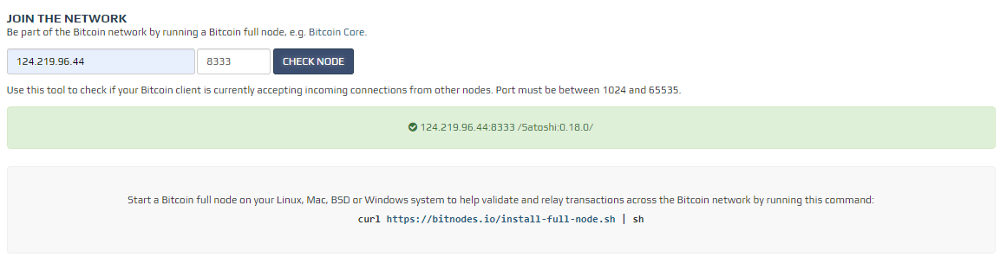
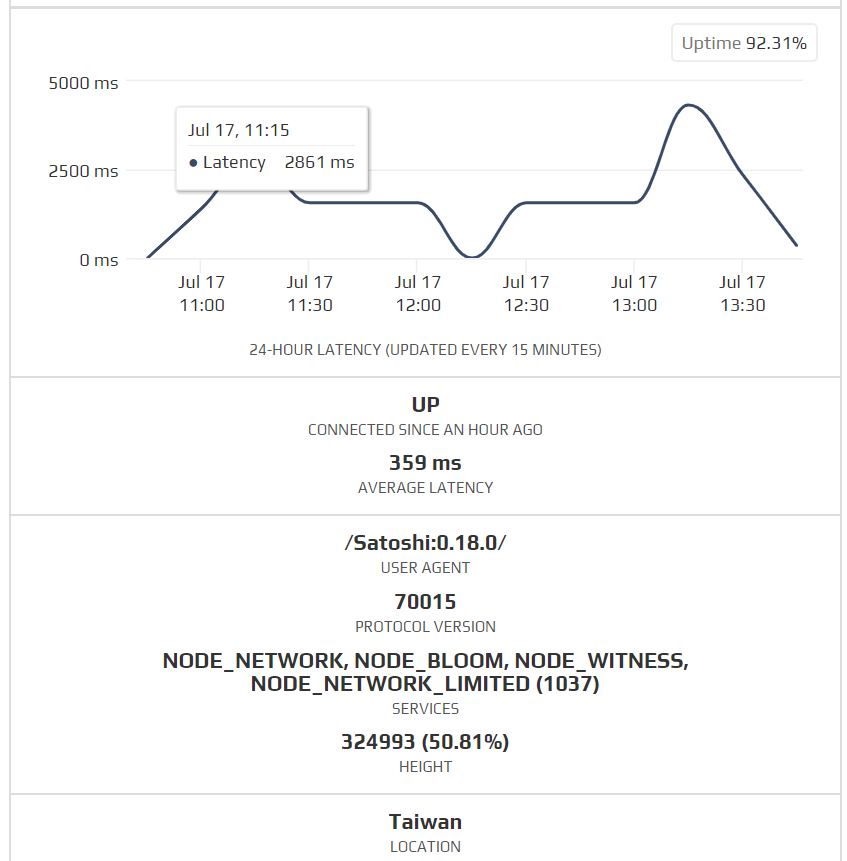

# Bitcoin Full Node

分為直接安裝以及使用docker安裝

## 直接安裝

### Step 1. 下載安裝包

到<a href="https://bitcoin.org/en/download">這裡</a>下載，這裡只有嘗試Linux的安裝

下載完後解壓縮
```
tar xzf bitcoin-0.20.0-x86_64-linux-gnu.tar.gz
```

安裝到/usr/local/bin並給予755權限
```
sudo install -m 0755 -o root -g root -t /usr/local/bin bitcoin-0.20.0/bin/*
```

安裝後可以選擇3中模式

- 圖形化(請閱讀<a href="https://bitcoin.org/en/full-node#other-linux-gui">圖形化設定方式</a>)
- 指令模式(請閱讀<a href="https://bitcoin.org/en/full-node#other-linux-gui">指令設定方式</a>)
- 同時都有(請兩個都閱讀，但兩者的配置不能一樣)

這裡安裝的是指令模式

先配置一個設定的檔案和存放的路徑
```
touch /usr/local/bin/bitcoin.conf
mkdir /usr/local/bin/bitcoin-data
```

在/usr/local/bin/bitcoin.conf裡寫上以下內容
```
conf=/usr/local/bin/bitcoin.conf
datadir=/usr/local/bin/bitcoin-data
```

輸入以下指令將會已配置啟動btc輸出"Bitcoin Core starting"，表示btc已經在啟動了
```
bitcoind -conf=/home/bitcoin/bitcoin.conf -daemon
``` 
啟動需要一些時間，你可以使用bitcoin-cli的指令來測試是否完成
```
bitcoin-cli getblockchaininfo
```
如果尚未完成會顯示以下錯誤代碼
```
bitcoin-cli：

error: {"code":-28,"message":"Verifying blocks..."}
```

當Bitcoin Core首次啟動時，他將會開始下載區塊鏈，並會占用大部分的平寬，下載至少需要幾天的時間，但我們也可以隨時使用指令停止他，下次啟動時會從停止時位置繼續下載
```
bitcoin-cli stop
```

<a href="bitcoin_core_install_centos7.txt">安裝教學 by.沅平</a>

## 使用docker安裝

安裝好docker(<a href="https://github.com/leoa12412a/Docker">方法</a>)後輸入以下指令，在/home/bitcoin裡面可以找到bitcoin.conf

<a href="https://github.com/kylemanna/docker-bitcoind">來源</a>，預設Wallet是disable的在指令內加入-e DISABLEWALLET=0 \就可以使用wallet的語法，其他設定也可以參考<a href="https://github.com/kylemanna/docker-bitcoind/blob/master/docs/config.md">bitcoind config tuning</a>

```
docker volume create --name=bitcoind-data;
docker run --name=bitcoind-node -d \
-p 8333:8333 \
-p 127.0.0.1:8332:8332 \
-e DISABLEWALLET=0 \
-v /home/bitcoin:/bitcoin/.bitcoin \
kylemanna/bitcoind;
```

輸入以下查詢資訊指令已檢測是否安裝成功

```
docker exec {CONTAINER ID} bitcoin-cli getblockchaininfo
```

在/home/bitcoin/bitcoin.conf配置設定檔以及儲存路徑
```
conf=/bitcoin/.bitcoin/bitcoin.conf
datadir=/bitcoin/.bitcoin/bitcoin-data
```

建立儲存空間和重新讀取配置檔
```
docker exec {CONTAINER ID} mkdir /bitcoin/.bitcoin/bitcoin-data
docker exec {CONTAINER ID} bitcoind -conf=/bitcoin/.bitcoin/bitcoin.conf -rescan
```
看到bitcoin-data裡面有block資料夾和debug.log就是成功了。

安裝成功後可以在<a href="https://bitnodes.io/#join-the-network">官網</a>上查到是否成功與其他節點連線

<br />

在網站上也可以搜尋到自己的IP(需要一段時間)，且在上面也可以查詢到下載進度和一些下載的資訊

<br />

## 開始使用

### 冷錢包 和 熱錢包
錢包是儲存虛擬貨幣的地方，但嚴格來說只是儲存自己的私鑰，有了私鑰我們才能去控制區塊鏈上的虛擬貨幣，而冷熱錢包就是兩種不同儲存私鑰的方式。
- 冷錢包:<br>
冷錢包，其實就是離線錢包，平常不會連上網，只有需要交易的時候才會連網。傳統的方式是把私鑰手抄到紙張上，但風險就在於，一但遺失了小紙條，比特幣就再也找不回來了…這的確很可能時常發生。
<br>

- 熱錢包:<br>
顧名思義是與冷錢包相反的，它是一種線上錢包（online wallet），可以儲存在手機、電腦或網頁，跟冷錢包需要花上千塊購置以及設定門檻相比，熱錢包特點是很便利也很容易取得，因為所有操作都是集中在網路上，不需要在每次交易時都大費周章地把冷錢包載體連結到網路上。
然而，熱錢包的操作都是在連網狀態下生成錢包的地址與私鑰，當私鑰都暴露在惡意滿滿的網路上時，也意味著無時無刻都要面對駭客攻擊跟網路釣魚的風險。

### 指令
關於bitcoin-cli的指令可以查看<a href="https://mistydew.github.io/blog/2018/05/bitcoin-cli-commands.html?fbclid=IwAR05nvAY7xFpCQO3IA1GQxvefWY02Ki4obfkMixWjEgY7x-7kegGrudrfzU">這裡</a>的中文指令介紹，但是新版本的bitcoin-cli有些方法已改變或是移除，請的指令及更改請參考<a href="https://bitcoin.org/en/release/v0.17.0#label-and-account-apis-for-wallet">這裡</a>
<br />
以下指令示範使用docker版本執行

### 建立新錢包
```
docker exec {CONTAINER ID} bitcoin-cli getnewaddress
```
結果 =>
產生地址為3PDxjkhX4rqXsV66vgteAZEMfuyfuCLTSx
```
# docker exec 3afef66e211 bitcoin-cli getnewaddress
3PDxjkhX4rqXsV66vgteAZEMfuyfuCLTSx
```

### 查詢錢包下所有帳號
原指令為bitcoin-cli listaccounts
```
docker exec {CONTAINER ID} bitcoin-cli listlabels
```
結果 =>
有一個帳號為""
```
# docker exec 3afef66e211 bitcoin-cli listlabels
[
  ""
]
```
### 查詢帳號下所有地址
原指令為getaddressesbyaccount
```
docker exec {CONTAINER ID} bitcoin-cli getaddressesbylabel {YOUR ACCOUNT0}
```
結果=>
```
# docker exec 3afef66e211 bitcoin-cli getaddressesbylabel ""
{
  "35cwEv5FXxA8Vf4jM35duhXa617DgykyT3": {
    "purpose": "receive"
  },
  "36tQRuANmhC4GGMcrd6hwVMR79Zige31ZM": {
    "purpose": "receive"
  },
  "3P93VFdx9v4i9FwHxMD7Jwoz9ppNyv9tXz": {
    "purpose": "receive"
  },
  "3PDxjkhX4rqXsV66vgteAZEMfuyfuCLTSx": {
    "purpose": "receive"
  }
}
```
